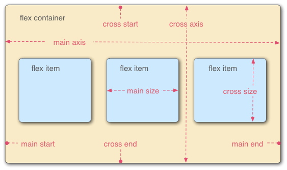

# CSS

## Adding CSS :
Adding CSS in HTML file for style the HTML code.
### Inline CSS :
It is added directly within HTML tag using the **style** attribute.
```html
<p style="color: blue; font-size: 16px;">This is an inline CSS example.</p>
```
### Internal CSS :

```html
<head>
    <style>
        p {
            color: green;
            font-size: 18px;
        }
    </style>
</head>
<body>
    <p>This is an internal CSS example.</p>
</body>
```


### External CSS :

```html
<head>
    <link rel="stylesheet" href="styles.css">
</head>
<body>
    <p>This is an external CSS example.</p>
</body>
```


### !important Keyword :
The !important keyword is used to give higher priority to a specific CSS rule, overriding other declarations.
```css
p {
  color: blue !important;   
  /* Color will add blue for !important */
}

p {
  color: red;
}
```

### CSS Comment :

```css
/* This is a CSS comment */
p {
  color: purple; /* This color applies to paragraph text */
}
```

## CSS Selector :
Targeting HTML contant.
### Element Selector :
Targets all instances of a specific HTML element.
```css
p {
  color: blue;
}
```


### ID Selector :
Targets a specific element with a unique id attribute. The # symbol is used before the id name.
```css
#header {
  background-color: lightgrey;
}
```


### Class Selector :
Targets elements with a specific class attribute. The . symbol is used before the class name.
```css
.highlight {
  background-color: yellow;
}
```


### Group Selector :
Applies the same style to multiple selectors. Selectors are separated by commas.
```css
h1, h2, p {
  margin: 0;
  padding: 10px;
}
```


### Universla Selector :
Targets all elements on the page. The * symbol is used as the universal selector.
```css
* {
  margin: 0;
  padding: 0;
}
```


## Font :
### Font Style :
Specifies the style of the font, such as normal, italic, or oblique.

```css
p {
  font-style: italic;
}
```


### Font Size :
Defines the size of the font. It can be set in various units like pixels (px), em, rem, percentages (%), etc.
```css
p {
  font-size: 16px;
}
```


### Font Weidth :
Controls the thickness (or boldness) of the font. Common values are normal, bold, bolder, lighter, or numeric values (100 to 900).
```css
p {
  font-weight: bold;
}
```


### Font Family :
Specifies the typeface or a list of typefaces for the text. You can provide multiple font names as a fallback list.
```css
p {
  font-family: "Arial", "Helvetica", sans-serif;
}
```


### Font Varient :
Controls the use of small-caps or other font variations.
```css
p {
  font-variant: small-caps;
}
```


### External/Google Font :
```html
<head>
  <link href="https://fonts.googleapis.com/css2?family=Roboto:wght@400;700&display=swap" rel="stylesheet">
</head>
```

```css
body {
  font-family: 'Roboto', sans-serif;
}
```

## Colors :
### Hexadecimal :
```css
p {
  color: #FF5733;
}
```

### RGB : 

```css
p {
  color: rgb(255, 87, 51);
}
```

### RGBA :
Similar to RGB but with an additional alpha (opacity) value, ranging from 0 (completely transparent) to 1 (completely opaque).
```css
p {
  color: rgba(255, 87, 51, 0.5);
}
```


### HSL (Hue, Saturation, Lightness)
* **Hue:** A degree on the color wheel (0-360), where 0 is red, 120 is green, and 240 is blue.
* **Saturation:** A percentage value (0% is a shade of gray, 100% is the full color).
* **Lightness:** A percentage value (0% is black, 50% is normal, 100% is white).

```css
p {
  color: hsl(11, 100%, 60%);
}
```


### Backgroung Color :

```css
div {
  background-color: rgb(255, 87, 51); /* RGB */
}
```


### Text Color :

```css
p {
  color: #FF5733; /* HEX */
}
```


## Border :
### Border Style :
Defines the style of the border. Common values include **none**, **solid**, **dashed**, **dotted**, **double, groove**, **ridge**, **inset**, and **outset**.
```css
div {
  border-style: solid;
}
```

### Border Width :
Can be specified in **pixels (px)**, **ems (em)**, or other length units. Also supports keywords like **thin**, **medium**, and **thick**.
```css
div {
  border-width: 2px;
}
```

### Border Color :
```css
div {
  border-color: #FF5733; /* HEX */
}
```

### Border :
A shorthand property that sets the **border-width**, **border-style**, and **border-color** in one declaration.

```css
div {
  border: 2px solid red;
}
```

### Border Redious :
Rounds the corners of the border. Can be set for all corners, or individually for each corner.
```css
div {
  border-radius: 10px 20px 30px 40px;
                /* top , right , bottom , left */
}
```

### Heigth :
Defines the height of an element. Can be set using various units such as **pixels (px)**, **percentages (%)**, **ems (em)** or **viewport units (vh).**
```css
div {
  height: 200px;
}
```


### Weidth :
Same as heigth.
```css
div {
  width: 50vw;
}
```


## Box :
### Box Mode :


### Padding :
* **Definition** :Space between the content of an element and its border. It is inside the element’s border.
* **Properties**: Can be set for all sides or individually for each side (top, right, bottom, left).

* **Shorthand**: padding: [top] [right] [bottom] [left];
```css
div {
  padding: 10px 15px 20px 25px;
}
```
* [top-botton] [right-left]
```css
div {
  padding: 10px 15px;
}
```
* [top-bottom-right-left]
```css
div {
  padding: 20px;
}
```
* Individual Side :
```css
div {
  padding-top: 10px;
  padding-right: 15px;
  padding-bottom: 20px;
  padding-left: 25px;
}
```


### Margin :
* **Definition**: Space outside the border of an element. It creates distance between the element’s border and surrounding elements.

* **Properties**: Can be set for all sides or individually for each side (top, right, bottom, left).

* **Shorthand**: margin: [top] [right] [bottom] [left];
```css
div {
  margin: 10px 15px 20px 25px;
}
```
* [top-botton] [right-left]
```css
div {
  margin: 10px 15px;
}
```
* [top-bottom-right-left]
```css
div {
  margin: 20px;
}
```
* Individual Side :
```css
div {
  margin-top: 10px;
  margin-right: 15px;
  margin-bottom: 20px;
  margin-left: 25px;
}
```


## Display Property :
### Display Block (display: block)
**Definition**: Makes an element a block-level element.
**Behavior**:
* Takes up the full width available, causing a line break before and after the element.
* Can have width, height, margins, and padding adjusted.

Examples of Block Elements: **div, h1, p, header.**


### Display Inline (display: inline)
**Definition**: Makes an element an inline element.
**Behavior**:
* Takes up only as much width as necessary, without forcing a line break.
* Cannot have width or height set directly.

Examples of Inline Elements: **span, a , strong , em**


### Block vs. Inline
* **Block Elements:**

    * Take up the full width of their container.
    * Start on a new line.
    * Support width, height, margin, and padding properties.

* **Inline Elements:**

    * Take up only as much width as their content needs.
    * Do not start on a new line.
    * Support only horizontal padding, margin, and line height.


### Display Convertion :
* **Converting Block to Inline**
```css
div {
  display: inline;
  /* This rule changes a block-level element like <div> to behave as an inline element. */
}
```

* **Convertion Inline to Block**

```css
span {
  display: block;
  /* This rule changes an inline element like <span> to behave as a block element. */
}
```


###  Inline-Block (display: inline-block)
* **Definition**: Combines the characteristics of both inline and block elements.
* **Behavior**:
    * Elements are laid out inline, without line breaks, but can have width, height, padding, and margin.
    * Use Case: Useful for creating horizontally aligned blocks that need sizing.

```css
div {
  display: inline-block;
  width: 150px;
  height: 150px;
  background-color: lightcoral;
  margin: 10px;
}
```


### Box Sizing Border Box (box-sizing: border-box)
* **Definition**: Alters the box model so that width and height include padding and borders, not just the content.
* **Default Behavior**: The default value is content-box, where width and height only include the content, and padding and borders are added outside.

```css
div {
  box-sizing: border-box;
  width: 300px;
  padding: 20px;
  border: 10px solid black;
  /* The div will remain 300 pixels wide, with padding and border inside this width. */
}
```

## Position Property :
### Position: Relative (position: relative)
The element is positioned relative to its normal position. You can move it using top, right, bottom, or left without affecting other elements.


```css
.relative-box {
  position: relative;
  top: 20px;
  left: 30px;
}
```
### position: absolute;
The element is positioned relative to its nearest positioned ancestor (not static). If no such ancestor exists, it is positioned relative to the initial containing block (usually the viewport).


```css
.absolute-box {
  position: absolute;
  top: 50px;
  right: 20px;
}
```
### position: fixed;
The element is positioned relative to the viewport, meaning it stays in the same place even when the page is scrolled.

```css
.fixed-box {
  position: fixed;
  bottom: 10px;
  left: 10px;
}
```
### position: sticky;
The element toggles between relative and fixed positioning, depending on the scroll position. It "sticks" to a defined position as you scroll past it.


```css
.sticky-box {
  position: sticky;
  top: 0;
  background-color: yellow;
}
```
## Units :
### px (Pixels)
A fixed unit representing the number of pixels on the screen. It provides precise control but is not responsive to different screen sizes.


```css
.box {
  width: 200px;
  height: 100px;
}
```
### % (Percentage)
A relative unit based on the parent element's size. It is useful for creating responsive designs.
```css
.box {
  width: 50%;
  height: 30%;
}
```
### em
A relative unit based on the font size of the element's parent. 1em equals the current font size. It scales with the element's font size.

```css
.text {
  font-size: 2em; /* If the parent font size is 16px, this will be 32px */
}
```
### rem
A relative unit based on the root element's (usually <html>) font size. It provides consistent scaling across the entire document.

```css
.text {
  font-size: 1.5rem; /* If the root font size is 16px, this will be 24px */
}
```
### vh (Viewport Height)
A relative unit based on the height of the viewport. 1vh equals 1% of the viewport's height.

```css
.box {
  width: 50vw; /* 50% of the viewport's width */
}
```
### vw (Viewport Width)
A relative unit based on the width of the viewport. 1vw equals 1% of the viewport's width.


```css
.box {
  height: 50vh; /* 50% of the viewport's height */
}
```

### float
The float property is used to position an element to the left or right of its container, allowing text or inline elements to wrap around it.

**Common values:**
* **left**: Floats the element to the left.
* **right**: Floats the element to the right.
* **none**: Default value, no float applied.
```css
.float-box {
  float: left;
  width: 200px;
  height: 100px;
  margin: 10px;
}
```
### clear
The clear property is used to control the behavior of elements that follow floated elements, ensuring that they do not wrap around the floated elements.

**Common values:**
* **left**: No element allowed on the left side.
* **right**: No element allowed on the right side.
* **both**: No element allowed on either side.
* **none**: Default value, allows wrapping.

```css
.clear-box {
  clear: both;
}
```
### overflow
The overflow property controls what happens to content that is too large for its container.

**Common values:**
* **visible**: Content is not clipped and may overflow the container.
* **hidden**: Content is clipped, and the rest is hidden.
* **scroll**: Content is clipped, but scrollbars are added to see the rest of the content.
* **auto**: Similar to scroll, but scrollbars are added only if needed.
```css
.overflow-box {
  width: 200px;
  height: 100px;
  overflow: scroll;
}
```
## FlexBox
Flexbox is a layout model that allows you to design complex layouts with ease by distributing space along a container's main and cross axes.



### display: flex;
Defines a flex container and enables the flex context for its children (flex items).

```css
.flex-container {
  display: flex;
}
```
### flex-direction
Specifies the direction of the flex items in the flex container.

**Common values:**
* **row**: Default, items are placed horizontally from left to right.
* **row-reverse**: Items are placed horizontally from right to left.
* **column**: Items are placed vertically from top to bottom.
* **column-reverse**: Items are placed vertically from bottom to top.


```css
.flex-container {
  flex-direction: row;
}
```
### flex-wrap
Specifies whether the flex items should wrap or not within the container.

**Common values**:
* **nowrap**: Default, items will not wrap.
* **wrap**: Items will wrap onto multiple lines.
* **wrap-reverse**: Items will wrap onto multiple lines in reverse order.
```css
.flex-container {
  flex-wrap: wrap;
}
```
### flex-flow
A shorthand property for flex-direction and flex-wrap.
```css
.flex-container {
  flex-flow: row wrap;
}
```
### justify-content
Aligns flex items along the main axis (horizontally by default).

**Common values:**
* **flex-start**: Default, items align to the start of the container.
* **flex-end**: Items align to the end of the container.
* **center**: Items are centered along the main axis.
* **space-between**: Items are evenly distributed with the first item at the start and the last item at the end.
* **space-around**: Items are evenly distributed with equal space around them.
* **space-evenly**: Items are evenly distributed with equal space between them.
```css
.flex-container {
  justify-content: center;
}
```
### align-items
Aligns flex items along the cross axis (vertically by default).

**Common values:**
* **stretch**: Default, items stretch to fill the container.
* **flex-start**: Items align to the start of the cross axis.
* **flex-end**: Items align to the end of the cross axis.
* **center**: Items are centered along the cross axis.
* **baseline**: Items align along their baseline.
```css
.flex-container {
  align-items: center;
}
```
### align-content
Aligns flex lines (rows or columns) within the flex container when there is extra space on the cross axis.

**Common values:**
* **stretch**: Default, lines stretch to fill the container.
* **flex-start**: Lines align to the start of the container.
* **flex-end**: Lines align to the end of the container.
* **center**: Lines are centered along the cross axis.
* **space-between**: Lines are evenly distributed with the first line at the start and the last line at the end.
* **space-around**: Lines are evenly distributed with equal space around them.
* **space-evenly**: Lines are evenly distributed with equal space between them.
```css
.flex-container {
  align-content: space-between;
}
```
### order
Controls the order of individual flex items. The default order is 0.

```css
.flex-item {
  order: 2;
}
```
### flex-grow

Defines the ability of a flex item to grow relative to the rest of the flex items when space is available. The default value is 0.


```css
.flex-item {
  flex-grow: 1;
}
```
### flex-shrink
Defines the ability of a flex item to shrink relative to the rest of the flex items when space is limited. The default value is 1.
```css
.flex-item {
  flex-shrink: 2;
}
```
### flex-basis
Specifies the initial size of a flex item before any space distribution occurs. It can be specified in any CSS size unit (e.g., px, %, em). The default value is auto.

```css
.flex-item {
  flex-basis: 200px;
}
```
### align-self
Allows you to override the align-items property for individual flex items, aligning them individually along the cross axis.

**Common values:**
* **auto**: Default, follows the container's align-items property.
* **flex-start**, **flex-end**, **center**, **baseline**, **stretch**: Same as align-items values but for individual items.
```css
.flex-item {
  align-self: flex-end;
}
```
## Media Queries
Media queries are a feature in CSS that allow you to apply styles conditionally based on certain criteria, such as the screen size, device orientation, resolution, and more. They are essential for creating responsive web designs that adapt to different devices.


```css
/* Basic syntex */
@media media-type and (media-feature: value) {
  /* CSS rules go here */
}
```
* media-type: Defines the type of device (e.g., screen, print, all).
* media-feature: Defines conditions like screen width, height, orientation, etc.
### Responsive Design (Screen Width)


```css
/* For devices with a maximum width of 600px (e.g., mobile phones) */
@media screen and (max-width: 600px) {
  .container {
    width: 100%;
    padding: 10px;
  }
}

/* For devices with a minimum width of 601px and maximum width of 1200px (e.g., tablets) */
@media screen and (min-width: 601px) and (max-width: 1200px) {
  .container {
    width: 80%;
    padding: 20px;
  }
}

/* For devices with a minimum width of 1201px (e.g., desktops) */
@media screen and (min-width: 1201px) {
  .container {
    width: 70%;
    padding: 30px;
  }
}
```
### Device Orientation
Apply styles based on whether the device is in portrait or landscape orientation.

```css
/* For devices in landscape mode */
@media screen and (orientation: landscape) {
  .gallery {
    display: flex;
    flex-direction: row;
  }
}

/* For devices in portrait mode */
@media screen and (orientation: portrait) {
  .gallery {
    display: flex;
    flex-direction: column;
  }
}
```
### Combining Multiple Conditions
```css
@media screen and (min-width: 768px) and (orientation: landscape) {
  .sidebar {
    display: block;
  }
}
```
## Shadow 

```css

```
### 

```css

```
### 

```css

```
### 

```css

```
### 

```css

```
### 

```css

```
### 

```css

```
### 

```css

```
### 

```css

```
### 

```css

```
### 

```css

```
### 

```css

```
### 

```css

```
### 

```css

```
### 

```css

```
### 

```css

```
### 

```css

```
### 

```css

```
### 

```css

```
### 

```css

```


